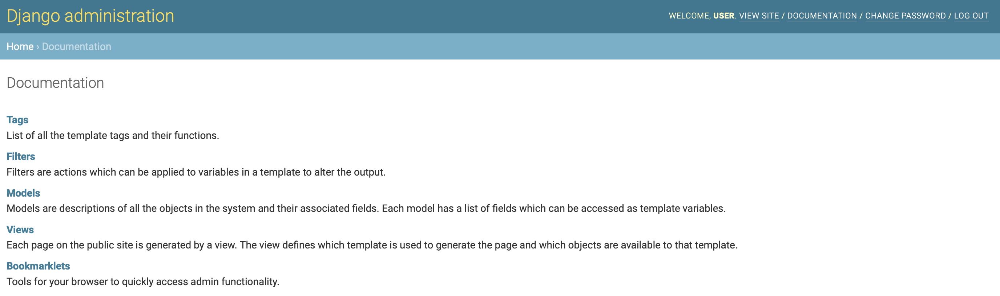

## App for online clothing shoping

1. Database
```bash
brew install postgresql
psql
```

2. Migrations
```bash
python manage.py makemigrations
python manage.py migrate
```

3. Generating example data
```
python manage.py runscript generate_data
```
Data will be saved in `data` directory

4. Loading data
```
python manage.py runscript load_data
```

5. Running server
```
python manage.py runserver
```

6. Running tests
```
python manage.py test
```

7. Running with admin panel
```
python manage.py createsuperuser
python manage.py runserver
go to: http://127.0.0.1:8000/admin/
```

--- Adding honeypot to django-admin ---
    - `pip install django-admin-honeypot`
    - add `"admin_honeypot"` to INSTALLED_APPS
    - update urls:
    ```
    urlpatterns = patterns(''
    ...
    url(r'^admin/', include('admin_honeypot.urls', namespace='admin_honeypot')),
    url(r'^secret/', admin.site.urls),
    )
    ```
    - run python manage.py migrate


--- Getting admin docs ---
    - `pip install docutils`
    - add `"django.contrib.admindocs"` to INSTALLED_APPS
    - add `path("admin/doc/", include("django.contrib.admindocs.urls"))` to urls.py
    - run your app and go to: `/admin/doc/`



--- Finite state machine in django ---
https://medium.com/@distillerytech/building-for-flexibility-using-finite-state-machines-in-django-2e36ddbd7708

`pip install django-fsm`